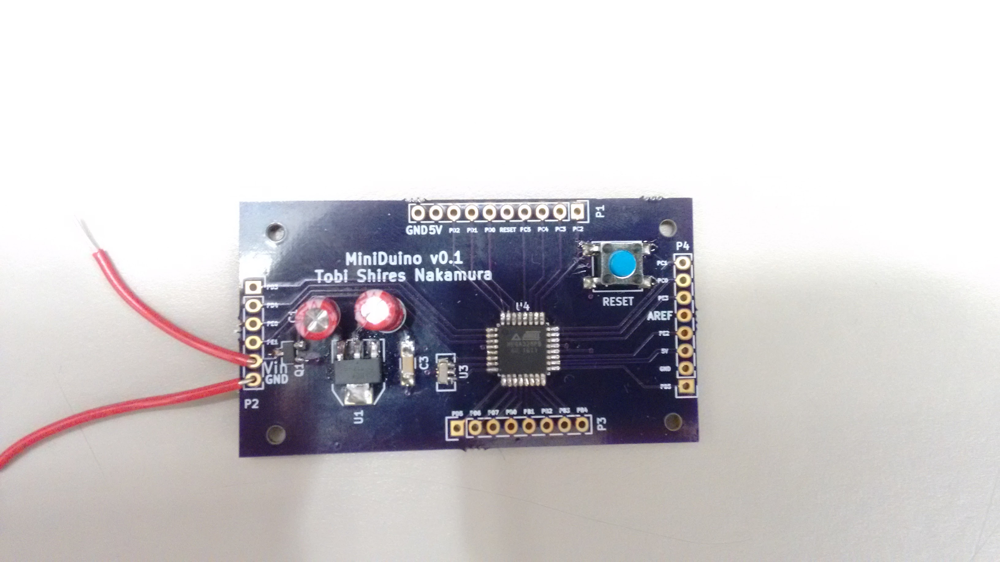
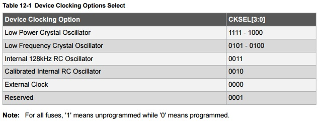

# MiniDuino
A minimalist arduino module featuring a ATmega328p, external clock, and 5v regulator with reverse polarity protection. 
Note unite does not have USART <-> USB capability.

The board was partially constructed to test the input polarity protection (up to 20v), voltage regulator (drop off 5.12v), and reset pin circuit (default pulled to 5v, button press pulls to GND).

MCU was drag soldered and the first blinky program is flashed. The factory default is for the MCU to use the internal RC oscillator, resulting in a very slow blinky.

Using AVRDude, fuse bits CKSEL[0..3] was changed from the default 0010 to 1111 for the external low power crystal oscilator.

Channel 1(yellow) is XTAL1, channel 2 (blue is XTAL2). Both waveforms are within spec. Just look at their stability...

