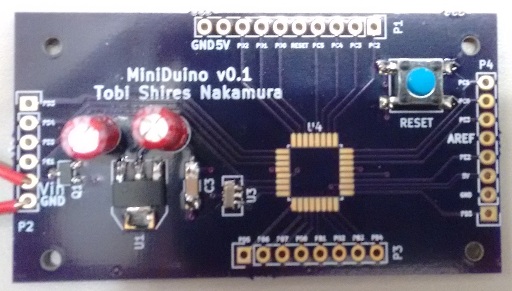

# MiniDuino
A minimalist arduino module featuring a ATmega328p, external clock, and 5v regulator with reverse polarity protection. 
Note unite does not have USART <-> USB capability.

The board was partially constructed to test the input polarity protection (up to 20v), voltage regulator (drop off 5.12v), and reset pin circuit (default pulled to 5v, button press pulls to GND).
